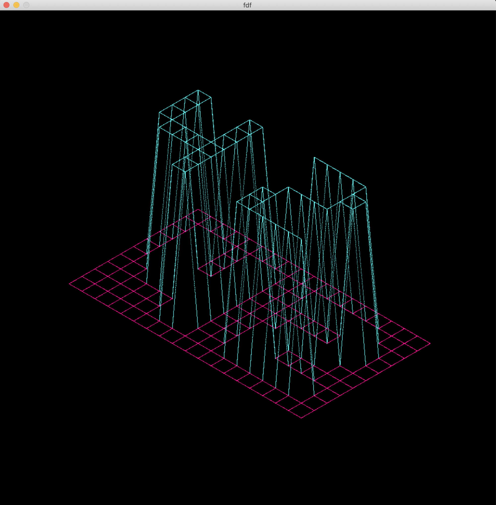

# FdF (42 project)
This project is about creating a simplified 3D graphic representation of a relief landscape
## Description
In this project, there were discover the basics of graphic programming, and in particular \
how to place points in space, how to join them with segments, and most importantly how \
to observe the scene from a particular viewpoint.
## Example of map
0  0  0  0  0  0  0  0  0  0  0  0  0  0  0  0  0  0  0 \
0  0  0  0  0  0  0  0  0  0  0  0  0  0  0  0  0  0  0 \
0  0  7  7  0  0  7  7  0  0  0  7  7  7  7  7  0  0  0 \
0  0  7  7  0  0  7  7  0  0  0  0  0  0  0  7  7  0  0 \
0  0  7  7  0  0  7  7  0  0  0  0  0  0  0  7  7  0  0 \
0  0  7  7  7  7  7  7  0  0  0  0  7  7  7  7  0  0  0 \
0  0  0  7  7  7  7  7  0  0  0  7  7  0  0  0  0  0  0 \
0  0  0  0  0  0  7  7  0  0  0  7  7  0  0  0  0  0  0 \
0  0  0  0  0  0  7  7  0  0  0  7  7  7  7  7  7  0  0 \
0  0  0  0  0  0  0  0  0  0  0  0  0  0  0  0  0  0  0 \
0  0  0  0  0  0  0  0  0  0  0  0  0  0  0  0  0  0  0 \
**Note:** This project is not about parsing. All maps you turning in should be valid.
## Running
1. Run `make` to compile project
2. Run `./fdf [map.fdf]` to force the program
## Example output

